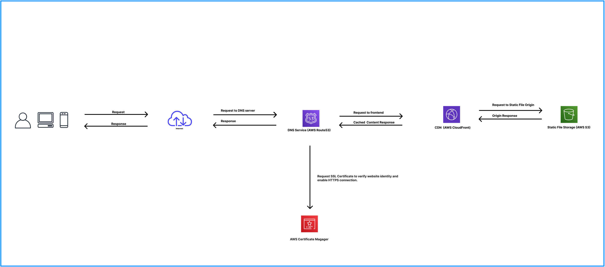

# How to host a static website on AWS S3:

This tutorial covers setting up and hosting a frontend project on AWS and configuring a CI/CD pipeline using the following technologies:

- AWS CloudFormation
- AWS S3
- AWS Certificate Manager
- AWS Route 53
- AWS CloudFront
- AWS IAM
- Github Actions

---

## Getting Started:

#### Prerequisites:

- An active AWS account with a valid payment option configured (bank account, credit card .etc). You can [register here](https://portal.aws.amazon.com/billing/signup?nc2=h_ct&src=header_signup&refid=78b916d7-7c94-4cab-98d9-0ce5e648dd5f&redirect_url=https%3A%2F%2Faws.amazon.com%2Fregistration-confirmation#/start/email).
- A Github Account. You can [register here](https://github.com/join).

## Architecture Diagram:


---

### 1. Fork and clone this repository.

### 2. Create an IAM User.

- Search IAM in the search bar and navigate to the IAM console.

- Click "Users" then "Create user".

- Enter a User name (example: frontend-github-actions).

- Click "Attach policies directly".

- In the search bar, search for "AdministratorAccess" and click the checkbox next to it.

- Click "Create user".

- Navigate to the user and click the "Security credentials" tab.

- Click "Create access key" and select "Command Line Interface (CLI)".

- Click "Next" then click "Create access key".

- Click "Download .csv file" in case you lose them.

- Copy the "Access key" and "Secret access key" then paste them somewhere for future reference.

### 3. Configure Github Actions secrets:

- Prepare the "Access key" and "Secret access key" copied in step 2.

- Navigate to your forked repository.

- Navigate to the "Settings" tab.

- Click "Secrets and variables".

- In the dropdown, click "Actions".

- Click "New repository secret"

- Create a secret named ```AWS_ACCESS_ID```, another secret named ```AWS_SECRET_ACCESS_KEY``` and another secret named ```S3_BUCKET_NAME```.

- Create a folder named ```.github``` in the root folder of your forked repository.

- Inside the ```.github``` folder, create a folder called ```workflows```. This is where Github looks for you Github Actions.

- In the ```.github/workflows/ folder```, create a file named ```frontend_deploy.yml``` and copy over this YAML document.

### 4. Create the frontend folder that will contain your application code:

You can create a frontend folder with at least one file that will be named index.html or you can use the CLI to create a Vue, Angular, React or Svelte project.

```Create a vanilla project```
```bash
mkdir frontend
```

```Create a reactive framework/library project```
```bash
# Vue.js
npm create vue@latest frontend

# Sevlte
npm create svelte@latest frontend

# React
npx create-react-app frontend

# Angular
ng new frontend
```

### 5. Create the infrastructure to host your application:

You can use AWS CLI to deploy the cloud formation template or you can follow the manual instructions below.

##### Create tbe S3 bucket:

- Navigate to the AWS S3 dashboard.
- Create an S3 bucket. `The name must be unique globally.`
- Choose your AWS region. `us-east-2 (Ohio)` is closest region to Kentucky.
- Uncheck the "Block all public access" checkbox.
- Check the "I acknowledge that the current settings might result in this bucket and the objects within becoming public." checkbox.
- Click the "Create bucket" button.

##### Enable "Static website hosting":

- Navigate to the S3 bucket you created.
- Open the "Properties" tab.
- Scroll down to the "Static website hosting" section.
- Click "Edit" then enable.
- Configure `index.html` as the "Index document".
- Click "Save changes".
- Navigate to the AWS provided S3 url.
- Access denied? 😮
- Update the bucket access policy in the "Permissions" tab using the `bucket-policy-a.json` policy.
- Navigate to the AWS provided S3 url.

##### Create an SSL Certificate:

- Navigate to the Certificate Manager dashboard.
- Click "Request".
- Click "Next".
- Add domain names. `example.com`, `www.example.com`, `*.example.com`.
- Click "Request".
- Click "List certificates"
- Click the certificate id.
- Click "Create records in Route 53"
- Wait until SSL certificate status shows as "Issued".

##### Configure CloudFront CDN:

- Navigate to the AWS CloudFront dashboard.
- Click "Create CloudFront distribution".
- Choose the origin domain. It will be the S3 url.
- Choose "Redirect HTTP to HTTPS".
- Choose "Use only North America and Europe".
- Choose "Enable security protections".
- Alternate domain names. `example.com`, `www.example.com`, `*.example.com`.
- Choose your custom SSL certificate.
- Wait for "Last modified" to change from "Deploying" to a date.


##### Configure Route 53 DNS.

- Navigate to Route 53 dashboard.
- Click "Hosted zones".
- Click the Hosted zone for your domain name.
- Click "Create record".
- Click "Record type" and choose "A – Routes traffic to an IPv4 address and some AWS resources".
- Toggle the "Alias" switch.
- Click "Choose endpoint" and choose "A – Routes traffic to an IPv4 address and some AWS resources".
- Click "Choose distribution" and select the distribution you created.
- Click "Create records".

##### Create Github Action:

- In the root directory, create a folder named `.github`.
- In the `.github` folder, create a folder named `workflows`.
- In the `workflows` folder, create a file named `deploy.yml`.
- Copy over the contents of `gh-example-a.yml` into `deploy.yml` or `gh-example-b.yml` for Angular, React, Vue or Svelte projects.
- Push up your changes.

##### Trigger Github Action:

- Make a change in your frontend folder and push it.

##### Clean up:

- Delete DNS records in Route 53.
- Disable and Delete CloudFront distribution.
- Delete S3 bucket contents/objects.
- Delete S3 bucket.